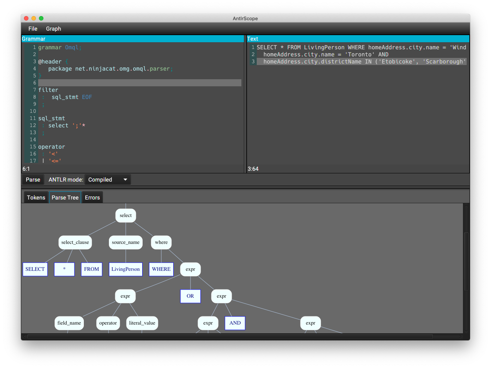

# AntlrScope

A simple UI for testing ANTLR4 grammars.

Supports Lexer and Combined grammars.

## Using

AntlrScope is a Java application, you will need Java 17+ to run it. 
Java 17-19 is required for the build. Java 20+ isn't supported yet. 

Get the latest zip archive from the [releases](https://github.com/uaraven/antlrscope/releases) unpack it somewhere
and run

    $ antlrscope-0.4.6/bin/antlrscope

or, on Windows

    > antlrscope-0.4.6/bin/antlrscope.bat

After AntlrScope starts you will be presented with the main window.

ANTLR grammar goes to the editor on the left, and the text to parse goes to the editor on the right, then click "Parse" button. Boom. That's it.

Output panel will display stream of tokens from lexer, parse tree (if available) and/or list of errors.

Parse tree can be exported in [dot](https://en.wikipedia.org/wiki/DOT_(graph_description_language)) format to be rendered with [graphviz](https://graphviz.org/).
Parsing must complete successfully before a Graph → Export menu could be available.

## Interpreting vs compilation

AntlrScope can use Antlr either in the interpreted mode or in compiled mode.

In the interpreted mode it is impossible to execute any code defined in the grammar, including predicates.
The interpreter runs as if there is not predicates at all.

The compiled mode generates Lexer and Parser source files, compiles them with Java compiler and then uses compiled classes
to tokenize and parse the code. It works exactly as if you generate a parser from the grammar as part of your maven/gradle build.

The interpreted mode is faster and doesn't require additional disk space, so if you don't need predicates, you can use it. 

## Limitations

AntlrScope always uses Java as a target language for generated lexers and parsers. If your
grammar includes code in other languages, you won't be able to generate lexer/parser and parse
the text successfully. 

You can try using interpreted mode, so that all the code in the grammar
is ignored, but, obviously, this might produce results that are different from expected.
