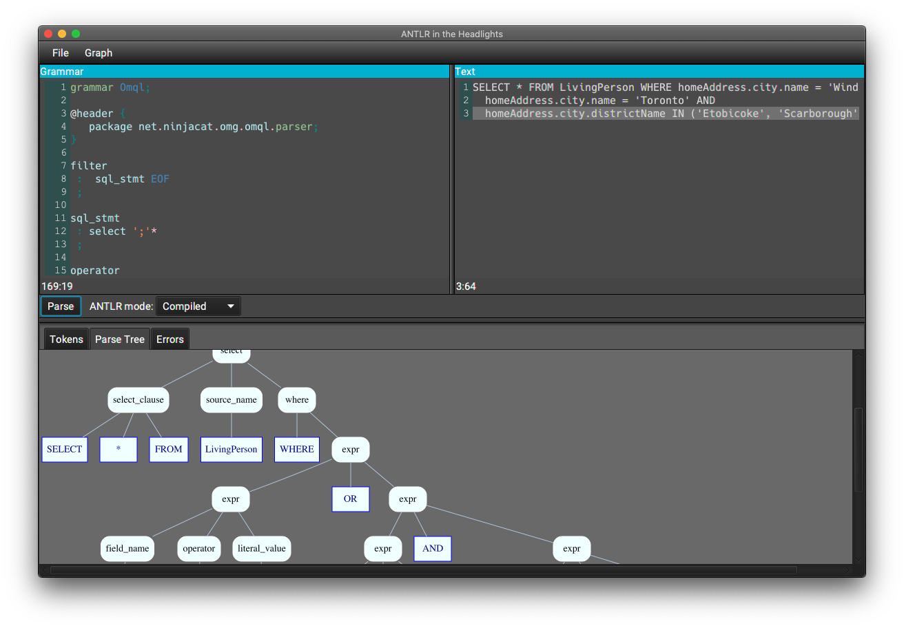

# Headlights

A simple UI for testing ANTLR4 grammars.

Supports Lexer and Combined grammars.

## Using

Headlights is a Java application, you will need Java 11 to run it.

Get the latest jar from the [releases](https://github.com/uaraven/headlights/releases) and run it with 

    java -jar headlights-<version-number>.jar
    
ANTLR grammar goes to the editor on the left, and the text to parse goes to the editor on the right, then click "Parse" button. Boom. That's it.

Output panel will display stream of tokens from lexer, parse tree (if available) and/or list of errors.

Parse tree can be exported in [dot](https://en.wikipedia.org/wiki/DOT_(graph_description_language)) format to be rendered with [graphviz](https://graphviz.org/).
Parsing must produce a parse tree before a Graph → Export menu could be available. 

## Interpreting vs compilation

Headlights can use Antlr either in the interpreted mode or in compiled mode.

In the interpreted mode it is impossible to execute any code defined in the grammar, including predicates.
The interpreter runs as if there is not predicates at all.

The compiled mode generates Lexer and Parser source files, compiles them with Java compiler and then uses compiled classes
to tokenize and parse the code. It works exactly as if you generate a parser from the grammar as part of your maven/gradle build.

The interpreted mode is faster and doesn't require additional disk space, so if you don't need predicates, you can use it. 

